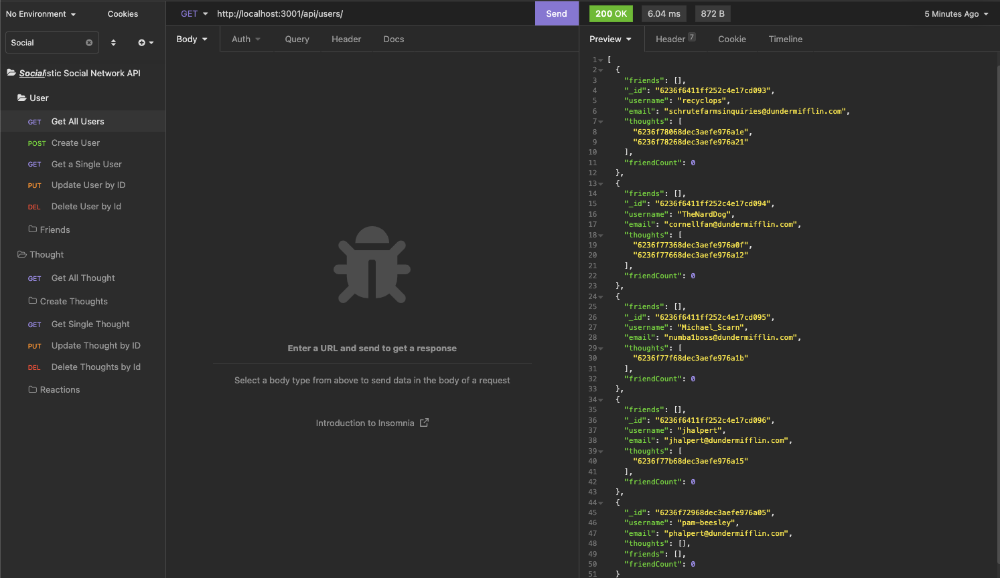
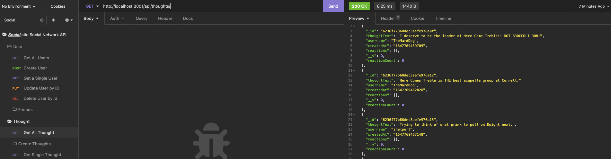
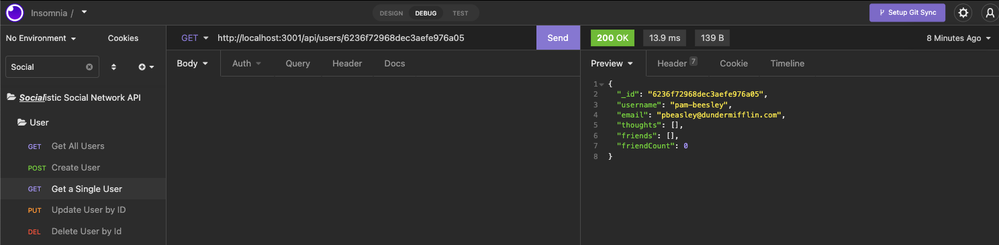
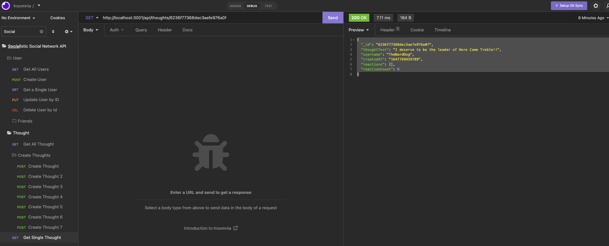
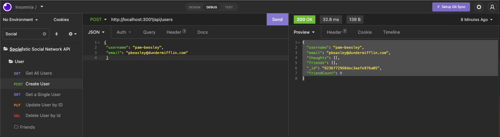
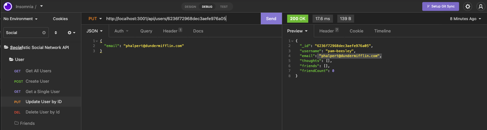
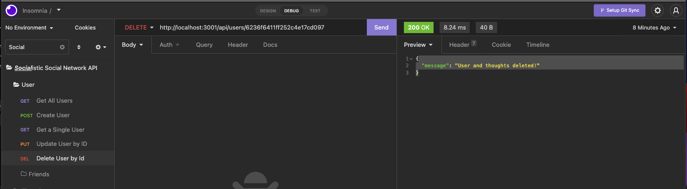
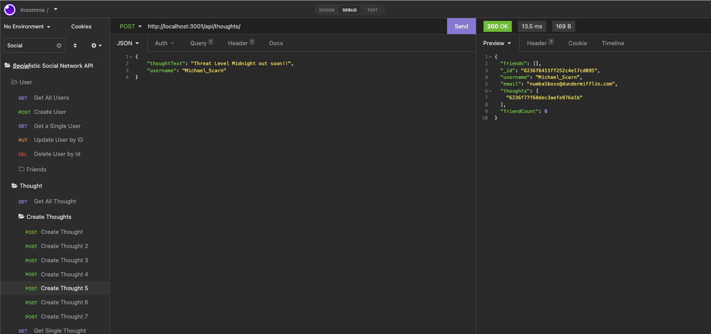
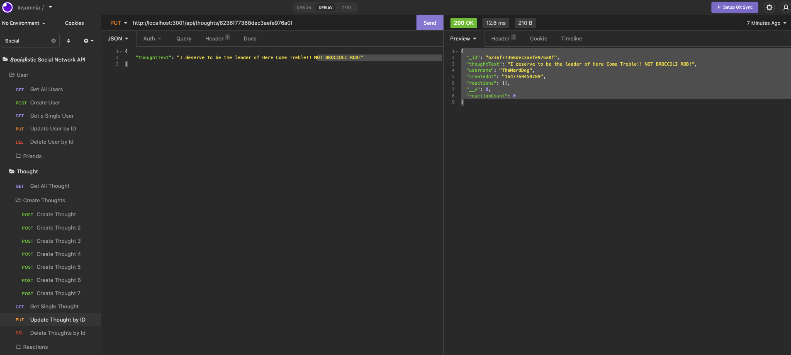
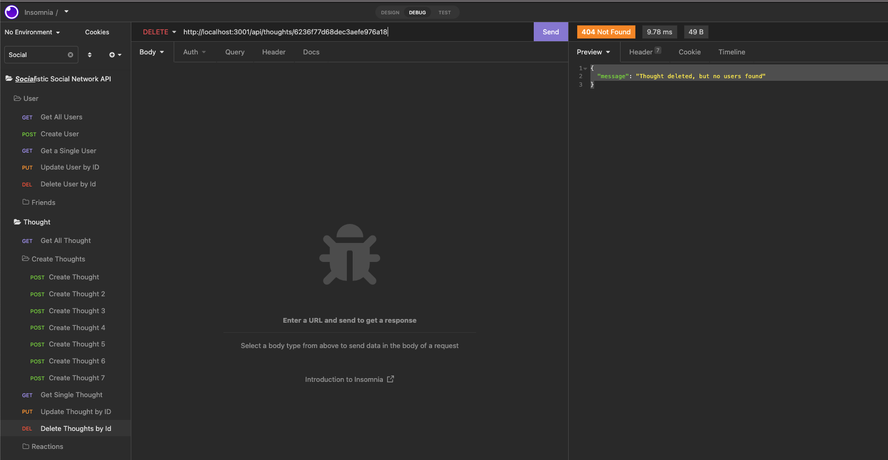

# Sweet Socialistic Social Networking API 

  In this application, I have created a simple social networking backend application! This project allows users to add friends and thoughts to their user profile. Additionally, you can comment your reaction to your friend's thoughts.  

## **DISCLAIMER:** Unfortunately, the application that I typically utilize to create my gifs and walkthrough videos is no longer compatible with my machine so I was unable to provide the assets I would have liked to. 
  # Table of Contents
  * [Installation](#installation)
  * [Usage](#usage)
  * [Contribution Guidelines](#contribution-guidelines)
  * [Tests](#tests)
  * [Questions](#questions)
  * [License](#license)

  ---
  ## Installations
  The only installation needed is to run `npm i` in the terminal once the repo is cloned. After the installation, run `npm start`. 

  ## Usage
  This is a basis for a social networking api that has the potentially to hav a front end connected and expanded in functionality on the backend. 
  
  Take a look at this short video for a walkthrough on how to use the application:

## Walkthrough

To view the walkthrough video: Please go to the Assets folder, then go to WALKTHROUGH.mov. The file must be opened from a Finder as it is not able to play in VSCode. 

Below, I have provided screenshots of the Insomnia functionality.

The following animations show examples of the application's API routes being tested in Insomnia.

The following animation shows GET routes to return all users and all thoughts being tested in Insomnia:

 

The following animation shows GET routes to return a single user and a single thought being tested in Insomnia:

The following images shows the POST, PUT, and DELETE routes for users being tested in Insomnia:

In addition to this, the images below show the POST, PUT, and DELETE routes for thoughts being tested in Insomnia.

  ## Contribution Guidelines
  Nope!

  ## Tests
  No tests.

  ## Questions
  
  If you have any questions or would like to contact me regarding aspects of this project, I can be reached at:
  * GitHub: kvs1995
  * Email: kvscoding@gmail.com

  ## License: MIT
      This project is licensed under the [MIT License](https://opensource.org/licenses/MIT).

## Related Links:
## GitHub Repo: https://github.com/kvs1995/sweet-socialistic-social-network-api